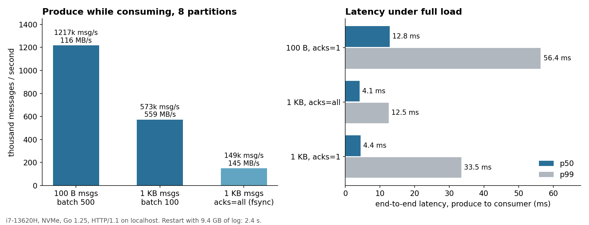

# logbroker

Брокер сообщений в духе Kafka на Go: партиционированные журналы только на дозапись,
разреженные индексы смещений, потребители с long polling, которые читают прямо из файлов
сегментов, смещения групп потребителей и долговечность через групповой коммит. Около 1 500
строк Go, из зависимостей только клиент Prometheus.



| | |
|---|---|
| Пропускная способность, сообщения по 100 Б | **1,22 млн сообщ./с**, при этом потребители вычитывают всё обратно |
| Пропускная способность, сообщения по 1 КБ | **573 тыс. сообщ./с, 559 МБ/с**, сквозная медиана 4,4 мс |
| `acks=all` (fsync до подтверждения) | **149 тыс. сообщ./с**, p99 12,5 мс: один fsync покрывает многих продюсеров |
| Перезапуск с журналом 9,4 ГБ | **2,4 с**: закрытые сегменты загружают сохранённый индекс, сканируется только активный |
| Запись внутри процесса | 1,2 ГБ/с в одну партицию, одна аллокация на пакет |

Замеры `cmd/loadgen`: 16 продюсеров и 8 потребителей с long polling против одного брокера
на ноутбуке (i7-13620H, NVMe), HTTP через localhost.

## Устройство

```
producer ──POST /produce──► партиция по хешу ключа ──► Partition.Append (одна запись на пакет)
                                                        │
                            flusher: fsync по таймеру или сразу, если ждёт acks=all
                                                        │
 сегменты:  00000000000000000000.log  .idx   (закрыт, 128 МБ)
            00000000000001203911.log         (активный)
                                                        │
consumer ──GET /fetch?offset=&wait_ms=──► поиск по разреженному индексу ──► sendfile(сегмент) ──► клиент
```

**Формат журнала.** Запись: `len | crc32c | offset | ts | klen | key | value`. Смещение
внутри записи позволяет потребителю заметить пропуск. Сегмент называется по своему первому
смещению и закрывается на 128 МБ.

**Разреженный индекс.** Одна запись индекса на 4 КиБ журнала. Чтение делает двоичный поиск
по индексу и просматривает не больше 4 КиБ заголовков до точного смещения. При закрытии
сегмента индекс пишется рядом (временный файл и rename). При старте ему доверяют, только
если записанный размер совпадает с файлом, поэтому после сбоя устаревший индекс никогда не
становится главным.

**Восстановление после сбоя.** Активный сегмент читается запись за записью. Первая запись
с неверной длиной, CRC или неожиданным смещением означает оборванную запись, и файл
обрезается в этом месте. Следующий сегмент, который не продолжает предыдущий, отбрасывается.

**Долговечность отдельно от записи.** Дозапись идёт только в страничный кэш. Flusher каждой
партиции делает fsync по таймеру (по умолчанию 100 мс) или сразу, если продюсер просит
`acks=all`, и будит всех продюсеров, чьё смещение теперь покрыто. Под нагрузкой один fsync
подтверждает десятки пакетов, поэтому режим с гарантией держит 149 тыс. сообщ./с.

**Чтение без копирования.** Fetch отдаёт целые записи в том виде, в каком они лежат на диске.
Обработчик копирует из `*os.File` в ответ, и `net/http` на Linux превращает это в
`sendfile(2)`: полезная нагрузка не проходит через кучу Go. Потребитель разбирает тот же
формат, что пишет брокер, включая проверку CRC.

**Long polling.** У каждой партиции есть канал, который закрывается и заменяется при каждой
дозаписи. Потребитель, дошедший до конца, ждёт на нём с таймаутом, поэтому новое сообщение
доходит до ждущих без задержки опроса.

**Группы потребителей.** Закоммиченные смещения хранятся в памяти и раз в секунду
сохраняются в `groups.json` через запись, fsync и rename.

## API

```bash
curl -X PUT 'localhost:9092/topics/orders?partitions=8'

# запись: повторяющиеся  klen u16 | vlen u32 | key | value  (см. pkg/client.EncodeBatch)
#   ?partition=N закрепляет пакет за партицией, иначе по хешу ключа; &acks=all ждёт fsync
POST /topics/orders/produce

# чтение целых записей с заданного смещения, ожидание новых данных до wait_ms
GET /topics/orders/partitions/3/fetch?offset=1200&max_bytes=1048576&wait_ms=500
#   заголовки: X-Next-Offset, X-High-Watermark, X-Records

POST /groups/billing/commit   {"topic":"orders","partition":3,"offset":1450}
GET  /groups/billing
GET  /topics                  # нижняя и верхняя границы по партициям
GET  /metrics                 # сообщения и байты на запись и чтение, задержка записи по acks
```

Клиент на Go в `pkg/client`: `EncodeBatch`, `Produce`, `Fetch`, `Decode`, `Commit`.

## Запуск

```bash
make run            # брокер на :9092, данные в ./data
make load           # 16 продюсеров и 8 потребителей, 20 с
make load-durable   # то же с acks=all
make test
docker build -t logbroker . && docker run -p 9092:9092 -v lb:/data logbroker
```

## Тесты

Смещения остаются уникальными и непрерывными при 16 параллельных продюсерах. Чтение со
случайных смещений работает через много маленьких сегментов. Оборванный хвост обрезается,
и дозапись продолжается с правильного смещения. `acks=all` завершается через flusher.
Очистка по сроку хранения никогда не удаляет активный сегмент. Топики и смещения групп
переживают перезапуск. После перезапуска закрытые сегменты читаются через сохранённые индексы.

## Чего не хватает для продакшена

- Репликации: протокол лидер-последователь с набором синхронных реплик и верхней границей,
  которая сдвигается только после того, как последователи догнали лидера.
- Бинарного протокола поверх TCP с конвейером запросов. Для маленьких сообщений узкое место
  здесь HTTP/1.1 на каждый пакет.
- Членства в группе с перебалансировкой партиций. Сейчас партиции выбирает клиент.
